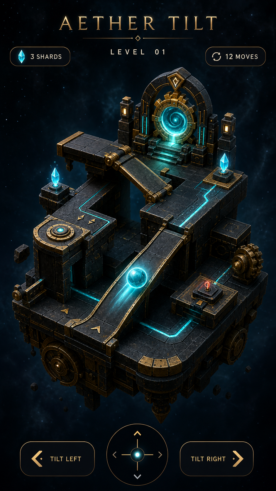

# Aether Tilt

Aether Tilt is Glint's flagship mobile game: a portrait-first gravity puzzle
set inside floating ancient-tech dioramas.

## First playable

- Shift gravity in four directions to slide the aether core.
- Recover every cyan shard, then reach the gold relic portal.
- Deterministic grid movement keeps touch play immediate and puzzle outcomes
  predictable.
- Flutter owns the HUD, navigation, victory sheet, and responsive mobile layout.
- Glint owns the 3D scene graph, procedural geometry, transforms, materials,
  camera, and lighting.

## Engine work unlocked by the game

1. Animated node transforms and a reusable frame clock.
2. Per-primitive GPU material batches for full diorama GLBs.
3. Scene instancing and a compact level-data format.
4. Lightweight collision/gravity helpers and audio hooks.
5. Mobile performance budgets and device validation.
